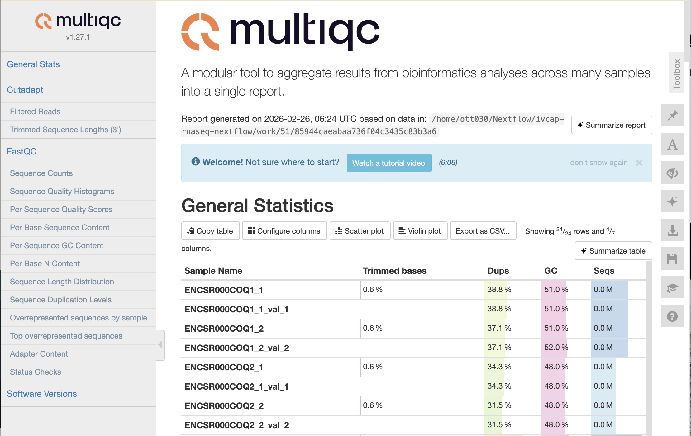

# ivcap-rnaseq-nextflow

This repository is a **minimal, worked example** showing how to **package a Nextflow pipeline** so it can be **deployed and executed on IVCAP**.

The pipeline implemented here is based on the Nextflow training material:

* https://training.nextflow.io/latest/nf4_science/rnaseq/03_multi-sample/

In this repo the pipeline focuses on a *paired-end* RNA-seq QC workflow using:

* **FastQC** (initial QC)
* **Trim Galore** (adapter trimming + post-trim QC)
* **MultiQC** (aggregated QC report)

> Note: There is a HISAT2 module present, but alignment is currently commented out in `main.nf`.

## Table of contents

* [Repository layout (high level)](#repository-layout-high-level)
* [Prerequisites](#prerequisites)
* [Run locally](#run-locally)
* [Deploy to IVCAP](#deploy-to-ivcap)
  * [DActual deployment)](#actual-deployment)
* [Test an IVCAP job request](#test-an-ivcap-job-request)
* [Notes / known quirks](#notes-known-quirks)
* [More instructions will follow](#more-instructions-will-follow)

## Repository layout (high level)

* `main.nf` — Nextflow entrypoint
* `nextflow.config` — Nextflow configuration (Docker enabled, reports/timeline/trace enabled)
* `modules/` — DSL2 modules used by the workflow
* `data/` — example inputs for local runs
  * `data/paired-end.csv` — example samplesheet used by default
* `schema_input.json` — JSON schema describing the sample input file structure (used by the IVCAP controller)
* `ivcap-service.yaml` — IVCAP *service definition* template (references the packaged pipeline artifact)
* `ivcap-tool.yaml` — JSON schema (AI tool) definition for the IVCAP job request payload (parameters + samplesheet)
* `tests/simple_rnaseq_ivcap.json` — example IVCAP job request
* `Makefile` — convenience targets for running, packaging, deploying, and testing

## Prerequisites

* Nextflow (and Docker if running with containers)
* **IVCAP CLI** (for deployment/testing against an IVCAP environment)
  * Install instructions: https://github.com/ivcap-works/ivcap-cli

## Run locally

This repo is configured to run with Docker.

```bash
$ make run
rm -rf .nextflow* work results
nextflow run "main.nf" \
        -c nextflow.config \
        -c conf/weblog.disabled.config \
        -params-file params.json \
        -cache false
Nextflow 25.10.4 is available - Please consider updating your version to it

 N E X T F L O W   ~  version 25.10.0

Launching `main.nf` [gloomy_shirley] DSL2 - revision: c8dbf9d8e0

executor >  local (13)
[cd/a09841] process > FASTQC (3)      [100%] 6 of 6 ✔
[71/218fb3] process > TRIM_GALORE (5) [100%] 6 of 6 ✔
[51/85944c] process > MULTIQC         [100%] 1 of 1 ✔
```

By default the pipeline reads the sample sheet from `data/paired-end.csv` (see `nextflow.config` and `main.nf`). Results are written to `results/`.
Opening `results/multiqc/all_paired-end.html` would show something like:



## Deploy to IVCAP

> This repository assumes you have the **IVCAP CLI** installed and configured.

This also requires:

* an **IVCAP service definition** file named `ivcap-service.yaml`, and
* an **IVCAP tool definition** file named `ivcap-tool.yaml`.

Examples of both are provided in this repository:

* `./ivcap-service.yaml` should primarily contain a **detailed `description`** of what the pipeline does and the **context** in which it should be used.
  * Currently, the only other required piece is to ensure `controller.pipeline.main_script` is set to the Nextflow entrypoint in this repository (i.e. `main.nf`).
* `./ivcap-tool.yaml` describes the **shape of the job request** as a JSON schema.
  * The request payload contains both:
    * `parameters`: the same sort of key/value parameters you would normally put in a Nextflow `-params-file`, and
    * `samples`: the sample sheet / sample list describing which read files to process.

### Actual deployment

The following make target will deploy this pipeline to the IVCAP platform configured as default in the `ivcap` cli command (`ivcap context get`)

```bash
make deploy
```

Under the hood this will:

1. **Tar up the pipeline** (Nextflow scripts, config, modules, and `schema_input.json`) into a single file (see `make package`, producing `simple-rna-seq.tar`).
2. **Upload that tarball to IVCAP** as an *artifact* (pipeline definition bundle).
3. **Register/update the service** identified by `SERVICE_ID` so it references the uploaded artifact id/URN in the Nextflow controller section of the service definition (see `ivcap-service.yaml`).


## Test an IVCAP job request

An example request payload is provided:

* `tests/simple_rnaseq_ivcap.json`

Submit it with:

```bash
make test-job
```

```text
$ make test-job
ivcap job create urn:ivcap:service:a98b81a8-9279-509f-9c0e-40d39e83058a -f tests/simple_rnaseq_ivcap.json --stream
---------
{
  "SeqID": "00013567",
  "eventID": "019c988c-1d3a-7ba6-8460-0cceaaac908a",
  "type": "ivcap.job.status",
  "schema": "urn:ivcap:schema:job.status.1",
  "source": "nxf-a98b81a8-9279-509f-9c0e-40d39e83058a-srkhwjtq",
  "timestamp": "2026-02-26T06:04:05.25563056Z",
  "data": {
    "job-urn": "urn:ivcap:job:d0e8225e-7de5-479e-b2c7-e8f23201c63e",
    "status": "executing"
  }
}
---------
{
  "SeqID": "00013568",
  "eventID": "019c988c-3f97-73fc-acfa-888e22b3a9db",
  "type": "ivcap.job.event",
  "schema": "urn:ivcap:schema:service.event.step.start.1",
  "source": "nxf-a98b81a8-9279-509f-9c0e-40d39e83058a-srkhwjtq",
  "timestamp": "2026-02-26T06:04:14.064734819Z",
  "data": {
    "$schema": "urn:ivcap:schema:service.event.step.start.1",
    "name": "download pipeline",
    "options": {
      "pipeline": "urn:ivcap:artifact:19111634-fe92-4585-8d0c-0f889c38d1de"
    }
  }
}
---------
...
---------
{
  "SeqID": "00013575",
  "eventID": "019c988f-20ab-7391-a435-fd0a22e78f11",
  "type": "ivcap.job.status",
  "schema": "urn:ivcap:schema:job.status.1",
  "source": "nxf-a98b81a8-9279-509f-9c0e-40d39e83058a-srkhwjtq",
  "timestamp": "2026-02-26T06:07:22.787549187Z",
  "data": {
    "job-urn": "urn:ivcap:job:d0e8225e-7de5-479e-b2c7-e8f23201c63e",
    "status": "succeeded"
  }
}
---------

       Name  nxf-a98b81a8-9279-509f-9c0e-40d39e83058a-srkhwjtq

         ID  urn:ivcap:job:d0e8225e-7de5-479e-b2c7-e8f23201c63e (@1)
     Status  executing
 Started At  3 minutes ago (26 Feb 26 17:04 AEDT)
    Service  urn:ivcap:service:a98b81a8-9279-509f-9c0e-40d39e83058a (@2)
     Policy  urn:ivcap:policy:ivcap.base.service
    Account  urn:ivcap:account:45a06508-5c3a-4678-8e6d-e6399bf27538
```

### Inspecting and downloading the result

Check all aspects created by the job

```
% ivcap datafabric query -e urn:ivcap:job:d0e8225e-7de5-479e-b2c7-e8f23201c63e

  Entity  urn:ivcap:job:d0e8225e-7de5-479e-b2c7-e8f23201c63e
 At Time  now (26 Feb 26 18:05 AEDT)
 Records  ┌────┬────────────────────────────────────────────────────┬───────────────────────────────────────────────────┐
          │ ID │ ENTITY                                             │ SCHEMA                                            │
          ├────┼────────────────────────────────────────────────────┼───────────────────────────────────────────────────┤
          │ @1 │ urn:ivcap:job:d0e8225e-7de5-479e-b2c7-e8f23201c63e │ urn:ivcap:schema:simple-rnaseq-pipeline.request.1 │
          │ @2 │ urn:ivcap:job:d0e8225e-7de5-479e-b2c7-e8f23201c63e │ urn:ivcap:schema:nextflow.result.1                │
          │ @3 │ urn:ivcap:job:d0e8225e-7de5-479e-b2c7-e8f23201c63e │ urn:ivcap:schema:job.result.1                     │
          │ @4 │ urn:ivcap:job:d0e8225e-7de5-479e-b2c7-e8f23201c63e │ urn:ivcap:schema:job.2                            │
          └────┴────────────────────────────────────────────────────┴───────────────────────────────────────────────────┘
```

The second entry holds the pipeline result (`schema: urn:ivcap:schema:nextflow.result.1`)
```
% ivcap datafabric get @2 --content-only
$schema: urn:ivcap:schema:nextflow.result.1
job_id: urn:ivcap:job:d0e8225e-7de5-479e-b2c7-e8f23201c63e
results_artifact_urn: urn:ivcap:artifact:c6879dfc-e10a-4428-8438-13e9a81affe3
status: succeeded
```

All the output files are contained in the artifact `results_artifact_urn`

```
% ivcap  --silent artifact download urn:ivcap:artifact:c6879dfc-e10a-4428-8438-13e9a81affe3 -f - | tar ztf -
./
./d0e8225e-7de5-479e-b2c7-e8f23201c63e/
./d0e8225e-7de5-479e-b2c7-e8f23201c63e/.nextflow.log
./d0e8225e-7de5-479e-b2c7-e8f23201c63e/output/
./d0e8225e-7de5-479e-b2c7-e8f23201c63e/output/pipeline_info/
./d0e8225e-7de5-479e-b2c7-e8f23201c63e/output/pipeline_info/execution_report_2026-02-26_06-04-41.html
...
./d0e8225e-7de5-479e-b2c7-e8f23201c63e/results/
./d0e8225e-7de5-479e-b2c7-e8f23201c63e/results/fastqc/
...
./d0e8225e-7de5-479e-b2c7-e8f23201c63e/results/multiqc/
./d0e8225e-7de5-479e-b2c7-e8f23201c63e/results/multiqc/all_paired-end.html
./d0e8225e-7de5-479e-b2c7-e8f23201c63e/results/multiqc/all_paired-end_data/
...
./d0e8225e-7de5-479e-b2c7-e8f23201c63e/results/trimming/
...
```

## Notes / known quirks

* `nextflow.config` sets `docker.fixOwnership = true` to avoid root-owned files in `work/`.
* Input handling:
  * Local runs default to `data/paired-end.csv`.
  * The workflow also accepts `--input <path>` or `--input_csv <path>`.

## More instructions will follow

This README is intentionally kept small and focused on the packaging/deployment mechanics. Additional, IVCAP-specific instructions will be added next.
